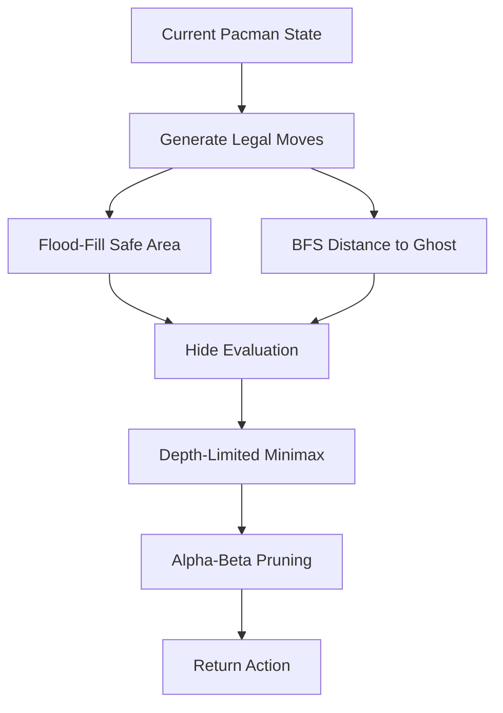
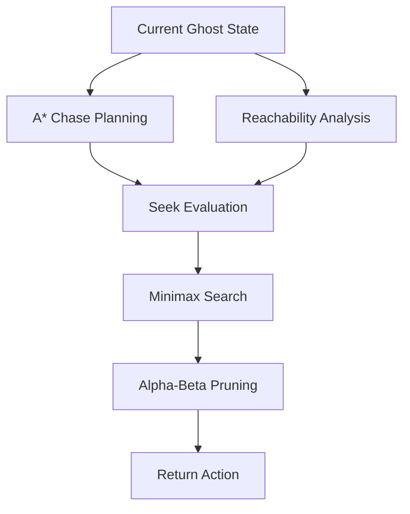
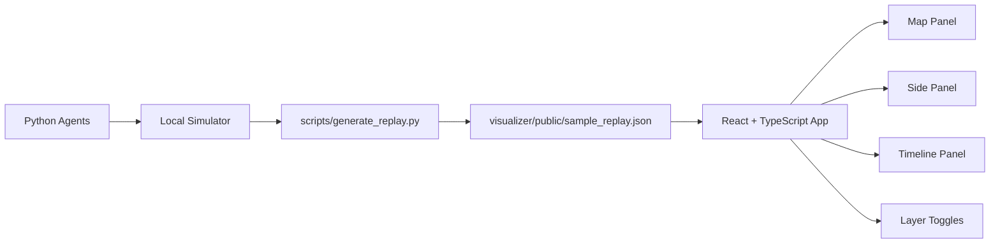

# Hide and Seek Arena - AI Search Agents

## 1. Project Overview

This project is Lab 1 of the Introduction to Artificial Intelligence course. It
implements search-based agents for the Hide and Seek Arena, a deterministic
two-player adversarial grid game.

The two agents are:

- Hide Agent (Pacman): tries to survive for as many steps as possible.
- Seek Agent (Ghost): tries to catch Pacman as quickly as possible.

The project focuses on classical AI search algorithms:

- Blind search.
- Heuristic search.
- Local evaluation-based search.
- Adversarial search.

It does not use machine learning, reinforcement learning, neural networks, Monte
Carlo Tree Search, or external AI frameworks.

Project goals:

- Build competitive tournament agents that obey the one-second action limit.
- Demonstrate classical AI search methods in a practical adversarial setting.
- Provide a clean Python submission package for Moodle.
- Provide a TypeScript visualizer for local debugging and educational analysis.

---

## 2. Environment

The backend simulator and TypeScript visualizer use the official Arena map from
the lab handout. The parsed handout text has 22 rows and 21 columns because the
provided layout includes both top and bottom border rows. Coordinates are stored
and displayed as `[row, col]`.

Each cell is either a wall or a traversable cell:

- `0`: traversable cell.
- `1`: wall.

The game has full observability. Both agents receive the map, their own
position, the enemy position, and the current step number. Actions are
simultaneous, deterministic, and grid-based. Ghost has a speed advantage in the
environment, so Pacman must avoid positions where escape routes collapse.

Winning conditions:

- Seek wins if `ManhattanDistance(Pacman, Ghost) < 2`.
- Hide wins if Pacman survives until the maximum step limit.

Official map illustration:

```text
#####################
#.........#.........#
#.###.###.#.###.###.#
#.###.###.#.###.###.#
#...................#
#.###.#.#####.#.###.#
#.....#...#...#.....#
#####.###.#.###.#####
#####.#...G...#.#####
#####.#.##.##.#.#####
#.......#...#.......#
#####.#.#####.#.#####
#####.#.......#.#####
#####.#.#####.#.#####
#.........#.........#
#.###.###.#.###.###.#
#...#.....P.....#...#
###.#.#.#####.#.#.###
#.....#...#...#.....#
#.#######.#.#######.#
#...................#
#####################

P = Hide Agent / Pacman
G = Seek Agent / Ghost
# = wall
. = traversable cell
```

---

## 3. Search-Based Approaches

### 3.1 Blind Search

#### Breadth-First Search (BFS)

Breadth-First Search expands states in increasing depth order using a FIFO
queue. On an unweighted graph, this means BFS finds the shortest path in number
of actions.

Properties:

- Complete on finite graphs.
- Optimal on unweighted graphs.
- Queue-based expansion.

Used for:

- Distance maps.
- Reachability analysis.
- Shortest-path computation.
- Safety and mobility features.

Complexity:

- Time: `O(V + E)`
- Space: `O(V)`

In this project, `V <= 441` because the grid is 21x21, so BFS is small enough
for repeated use when cached.

#### Uniform Cost Search (UCS)

Uniform Cost Search expands the lowest-cost frontier node first using a priority
queue. It is optimal when step costs are non-negative.

Because every legal movement in this grid has equal cost, BFS behaves
equivalently to UCS in this project. BFS is therefore used as the simpler and
faster implementation for exact shortest-path distances.

#### Depth-First Search (DFS)

Depth-First Search expands the deepest available node first using a stack or
recursion. DFS is memory-efficient, but it is not optimal for shortest paths in
general.

DFS is included conceptually for comparison and educational purposes. It is not
the primary strategy because the agents need accurate shortest-path distances
and layered safety information.

### 3.2 Heuristic Search

#### Greedy Best-First Search

Greedy Best-First Search selects nodes using only the heuristic value `h(n)`. It
is fast because it focuses on states that appear promising, but it is not
guaranteed to find an optimal path.

In this project, greedy reasoning appears in action ordering. Candidate actions
are first ranked by estimated safety or capture pressure before deeper
adversarial search is applied.

#### A* Search

A* combines path cost and heuristic guidance:

```text
f(n) = g(n) + h(n)
```

Where:

- `g(n)`: path cost from the current position to node `n`.
- `h(n)`: Manhattan distance estimate from `n` to the target.

The Manhattan heuristic is admissible because it never overestimates the number
of four-neighbor grid moves in an obstacle-free lower bound. It is also
consistent because moving one step changes the Manhattan estimate by at most one.

Used for:

- Chase planning by the Seek Agent.
- Escape-route analysis by the Hide Agent through distance and path features.
- Path reconstruction for debugging and visualization.

Complexity:

- Worst-case time: `O(E log V)` with a priority queue.
- Space: `O(V)`.
- On this 21x21 grid, the heuristic usually reduces expansions substantially.

### 3.3 Local Search and Evaluation Functions

Search is not only pathfinding. The agents must evaluate states because a move
that is locally closer or farther may still be strategically poor.

Each legal action is treated as a neighboring candidate state. The agent scores
each candidate with an evaluation function, then refines the choice with
limited-depth adversarial search.

Hide evaluation rewards:

- Maximizing distance from Ghost.
- Maximizing reachable safe area.
- Maximizing branching factor.
- Preserving future mobility.

Hide evaluation penalizes:

- Dead ends.
- Narrow corridors near Ghost.
- Low safe-area states.
- Trap risk.

Seek evaluation rewards:

- Minimizing distance to Hide.
- Reducing enemy mobility.
- Increasing interception potential.
- Forcing Hide into corridors or dead ends.

### 3.4 Adversarial Search

#### Minimax

Hide and Seek form a two-player zero-sum adversarial problem. Hide maximizes
survival utility. Seek minimizes Hide's advantage and maximizes capture
potential.

The implementation uses depth-limited minimax because the one-second action
limit prevents exhaustive search to the end of the game.

#### Alpha-Beta Pruning

Alpha-beta pruning improves minimax efficiency by maintaining two bounds:

- `alpha`: the best value found so far for the maximizing player.
- `beta`: the best value found so far for the minimizing player.

When `beta <= alpha`, the remaining branch cannot change the final minimax
decision and can be pruned.

Alpha-beta pruning reduces runtime while preserving the same decision result as
full minimax at the same depth. The implementation also orders actions
heuristically so strong branches are considered first.

---

## 4. Agent Design

### Hide Agent

Decision pipeline:

1. Generate legal moves.
2. Run flood-fill analysis.
3. Run BFS distance analysis.
4. Score candidate states with the Hide evaluation function.
5. Refine decisions with minimax.
6. Return the final action.

Hide decision pipeline:



### Seek Agent

Decision pipeline:

1. Run A* chase planning.
2. Analyze reachability and interception opportunities.
3. Run minimax search.
4. Apply alpha-beta pruning.
5. Return the final action.

Seek decision pipeline:



Visualizer architecture:



UI panels:

- Map Panel: grid, walls, Pacman, Ghost, paths, explored cells, danger cells,
  safe area, dead ends, and candidate arrows.
- Algorithm Step Inspector: chronological reasoning pipeline with clickable
  sections for legal moves, BFS, A*, flood fill, danger/dead-end analysis,
  candidate evaluation, and minimax alpha-beta.
- Score and Explanation Panel: current step, selected agent, algorithm name, chosen action,
  action scores, explanation text, and search-frame statistics.
- Timeline Panel: game-step slider, previous/next controls, play/pause, speed,
  and search expansion frame slider.
- Search Playback: frame-by-frame animation for BFS, A*, flood fill, and
  minimax candidates.

How to interpret inspector panels:

- BFS Inspector: queue/frontier growth, explored count, distance map size, and
  final path.
- A* Inspector: current node, open/closed sets, and tracked `g(n)`, `h(n)`, and
  `f(n)` values.
- Flood Fill Inspector: reachable and safe-area expansion counts.
- Danger/Dead-End Inspector: danger heat, dead ends, corridors, and junction
  cells.
- Candidate Evaluation Inspector: feature and weighted-term breakdowns for every
  action.
- Minimax Viewer: root/action branches, leaf values, alpha/beta metadata,
  pruning events, and the best action.

Keyboard controls:

- `SPACE`: play or pause game replay.
- `LEFT` / `RIGHT`: previous or next game step.
- `N` / `B`: next or previous search frame.
- `TAB`: switch Hide, Seek, and side-by-side trace mode.
- `1`: BFS.
- `2`: A*.
- `3`: Flood Fill.
- `4`: Danger/Dead-End.
- `5`: Candidate Scores.
- `6`: Minimax Tree.
- `0`: all layers off.

Supported visualizations:

- BFS expansion.
- A* path.
- Flood fill area.
- Minimax candidate actions.
- Alpha-beta pruned branches when present in trace data.

Screenshot placeholders:

```text
[Screenshot Placeholder: Map Panel showing BFS expansion and A* path]
[Screenshot Placeholder: Side Panel showing action scores and explanation]
[Screenshot Placeholder: Timeline Panel controlling replay playback]
```

---

## 5. Running the Project

Run the Python smoke test:

```bash
python scripts/run_smoke_test.py
```

Generate a replay for the TypeScript visualizer:

```bash
python scripts/generate_replay.py
```

For the full AI Search Inspector replay:

```bash
python scripts/generate_replay.py --trace-level full
```

Run the web visualizer:

```bash
cd visualizer
npm install
npm run dev
```

Build the web visualizer:

```bash
cd visualizer
npm run build
```
---

## Replay Data Contract

The current TypeScript visualizer uses a stable replay-driven data contract.
Python runs the simulator and writes JSON once after the episode ends. The
browser only reads JSON; it never calls Python directly.

Replay file:

```text
visualizer/public/match_log.json
```

For compatibility, the same content is also copied to:

```text
visualizer/public/sample_replay.json
```

Schema:

```json
{
  "map": [[0, 1, 0]],
  "width": 21,
  "height": 22,
  "initial": {
    "pacman": [16, 10],
    "ghost": [8, 10]
  },
  "steps": [
    {
      "stepNumber": 0,
      "pacmanPos": [16, 10],
      "ghostPos": [8, 10],
      "pacmanAction": "STAY",
      "ghostAction": "DOWN",
      "manhattanDistance": 8,
      "exploredNodes": [[16, 10], [16, 9]],
      "predictedPath": [[16, 10], [15, 10]],
      "score": 120.5,
      "candidateScores": {
        "UP": 82.5,
        "DOWN": 51.0,
        "LEFT": -20.0,
        "RIGHT": 144.7,
        "STAY": 10.2
      },
      "chosenAgent": "hide",
      "algorithm": "BFS + Flood Fill + Minimax",
      "explanation": "The selected action improves safety according to the search evaluation."
    }
  ]
}
```

Coordinates are always `[row, col]`. The frontend reads `width` and `height`
from JSON and does not hard-code the board size.

## Visualizer

The simplified visualizer contains:

- `GameBoard`: official map, Pacman, Ghost, explored nodes, predicted path, and
  grid lines.
- `DashboardPanel`: current step, positions, Manhattan distance, algorithm,
  score, chosen agent, and explanation.
- `ScorePanel`: action-score table with best score highlighted green, worst
  score highlighted red, and chosen action outlined.
- `LayerToggles`: explored nodes, predicted path, candidate scores, and grid.
- `ControlPanel`: play, pause, previous step, next step, restart, step slider,
  and replay speed.

Generate replay:

```bash
python scripts/generate_replay.py --trace-level full
```

Run UI:

```bash
cd visualizer
npm install
npm run dev
```

Keyboard controls:

- `SPACE`: play or pause.
- `LEFT`: previous step.
- `RIGHT`: next step.
- `R`: restart.
- `E`: toggle explored nodes.
- `P`: toggle predicted path.
