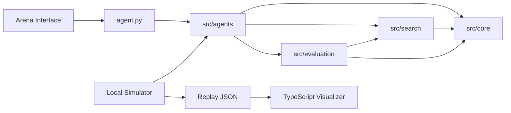
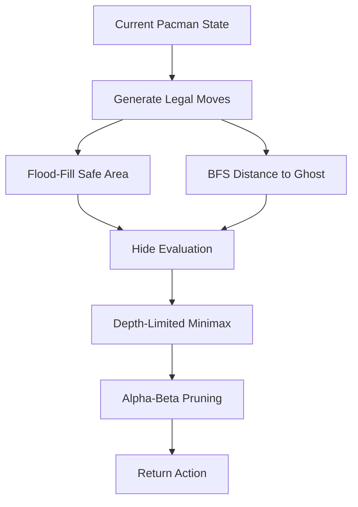
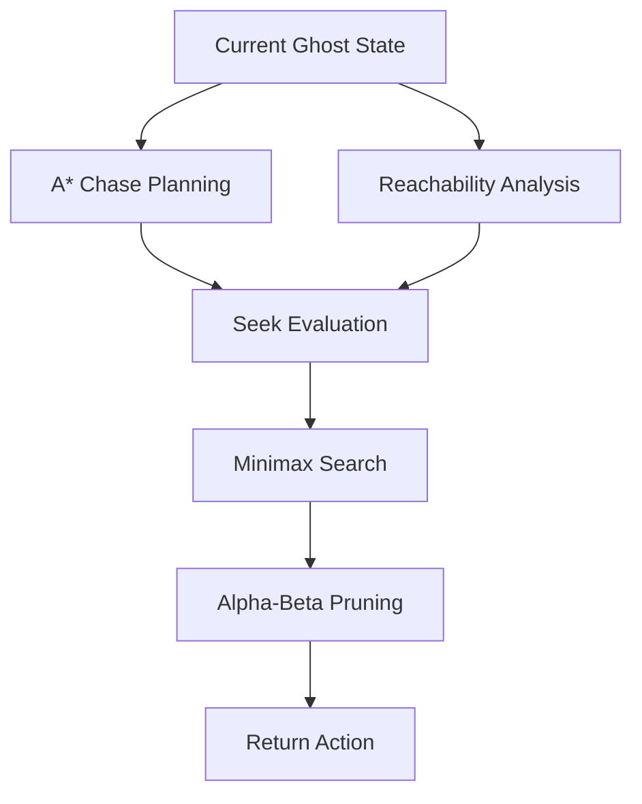
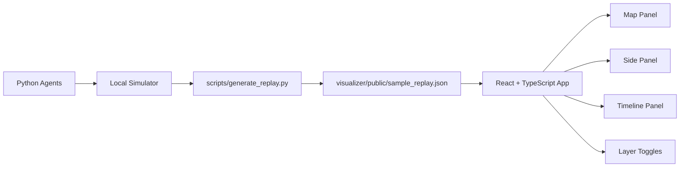

# Hide and Seek Arena - AI Search Agents

## 1. Project Overview

This project is Lab 1 of the Introduction to Artificial Intelligence course. It
implements search-based agents for the Hide and Seek Arena, a deterministic
two-player adversarial grid game.

The two agents are:

- Hide Agent (Pacman): tries to survive for as many steps as possible.
- Seek Agent (Ghost): tries to catch Pacman as quickly as possible.

The project focuses on classical AI search algorithms:

- Blind search.
- Heuristic search.
- Local evaluation-based search.
- Adversarial search.

It does not use machine learning, reinforcement learning, neural networks, Monte
Carlo Tree Search, or external AI frameworks.

Project goals:

- Build competitive tournament agents that obey the one-second action limit.
- Demonstrate classical AI search methods in a practical adversarial setting.
- Provide a clean Python submission package for Moodle.
- Provide a TypeScript visualizer for local debugging and educational analysis.

---

## 2. Environment

The backend simulator and TypeScript visualizer use the official Arena map from
the lab handout. The parsed handout text has 22 rows and 21 columns because the
provided layout includes both top and bottom border rows. Coordinates are stored
and displayed as `[row, col]`.

Each cell is either a wall or a traversable cell:

- `0`: traversable cell.
- `1`: wall.

The game has full observability. Both agents receive the map, their own
position, the enemy position, and the current step number. Actions are
simultaneous, deterministic, and grid-based. Ghost has a speed advantage in the
environment, so Pacman must avoid positions where escape routes collapse.

Winning conditions:

- Seek wins if `ManhattanDistance(Pacman, Ghost) < 2`.
- Hide wins if Pacman survives until the maximum step limit.

Official map illustration:

```text
#####################
#.........#.........#
#.###.###.#.###.###.#
#.###.###.#.###.###.#
#...................#
#.###.#.#####.#.###.#
#.....#...#...#.....#
#####.###.#.###.#####
#####.#...G...#.#####
#####.#.##.##.#.#####
#.......#...#.......#
#####.#.#####.#.#####
#####.#.......#.#####
#####.#.#####.#.#####
#.........#.........#
#.###.###.#.###.###.#
#...#.....P.....#...#
###.#.#.#####.#.#.###
#.....#...#...#.....#
#.#######.#.#######.#
#...................#
#####################

P = Hide Agent / Pacman
G = Seek Agent / Ghost
# = wall
. = traversable cell
```

---

## 3. Search-Based Approaches

### 3.1 Blind Search

#### Breadth-First Search (BFS)

Breadth-First Search expands states in increasing depth order using a FIFO
queue. On an unweighted graph, this means BFS finds the shortest path in number
of actions.

Properties:

- Complete on finite graphs.
- Optimal on unweighted graphs.
- Queue-based expansion.

Used for:

- Distance maps.
- Reachability analysis.
- Shortest-path computation.
- Safety and mobility features.

Complexity:

- Time: `O(V + E)`
- Space: `O(V)`

In this project, `V <= 441` because the grid is 21x21, so BFS is small enough
for repeated use when cached.

#### Uniform Cost Search (UCS)

Uniform Cost Search expands the lowest-cost frontier node first using a priority
queue. It is optimal when step costs are non-negative.

Because every legal movement in this grid has equal cost, BFS behaves
equivalently to UCS in this project. BFS is therefore used as the simpler and
faster implementation for exact shortest-path distances.

#### Depth-First Search (DFS)

Depth-First Search expands the deepest available node first using a stack or
recursion. DFS is memory-efficient, but it is not optimal for shortest paths in
general.

DFS is included conceptually for comparison and educational purposes. It is not
the primary strategy because the agents need accurate shortest-path distances
and layered safety information.

### 3.2 Heuristic Search

#### Greedy Best-First Search

Greedy Best-First Search selects nodes using only the heuristic value `h(n)`. It
is fast because it focuses on states that appear promising, but it is not
guaranteed to find an optimal path.

In this project, greedy reasoning appears in action ordering. Candidate actions
are first ranked by estimated safety or capture pressure before deeper
adversarial search is applied.

#### A* Search

A* combines path cost and heuristic guidance:

```text
f(n) = g(n) + h(n)
```

Where:

- `g(n)`: path cost from the current position to node `n`.
- `h(n)`: Manhattan distance estimate from `n` to the target.

The Manhattan heuristic is admissible because it never overestimates the number
of four-neighbor grid moves in an obstacle-free lower bound. It is also
consistent because moving one step changes the Manhattan estimate by at most one.

Used for:

- Chase planning by the Seek Agent.
- Escape-route analysis by the Hide Agent through distance and path features.
- Path reconstruction for debugging and visualization.

Complexity:

- Worst-case time: `O(E log V)` with a priority queue.
- Space: `O(V)`.
- On this 21x21 grid, the heuristic usually reduces expansions substantially.

### 3.3 Local Search and Evaluation Functions

Search is not only pathfinding. The agents must evaluate states because a move
that is locally closer or farther may still be strategically poor.

Each legal action is treated as a neighboring candidate state. The agent scores
each candidate with an evaluation function, then refines the choice with
limited-depth adversarial search.

Hide evaluation rewards:

- Maximizing distance from Ghost.
- Maximizing reachable safe area.
- Maximizing branching factor.
- Preserving future mobility.

Hide evaluation penalizes:

- Dead ends.
- Narrow corridors near Ghost.
- Low safe-area states.
- Trap risk.

Seek evaluation rewards:

- Minimizing distance to Hide.
- Reducing enemy mobility.
- Increasing interception potential.
- Forcing Hide into corridors or dead ends.

### 3.4 Adversarial Search

#### Minimax

Hide and Seek form a two-player zero-sum adversarial problem. Hide maximizes
survival utility. Seek minimizes Hide's advantage and maximizes capture
potential.

Minimax tree illustration:

```text
                    Current State
                         |
                 Hide chooses action
          /              |              \
       UP              RIGHT           STAY
       |                 |               |
  Seek response     Seek response   Seek response
   /     \            /     \          /     \
 eval   eval       eval   eval     eval   eval
```

The implementation uses depth-limited minimax because the one-second action
limit prevents exhaustive search to the end of the game.

#### Alpha-Beta Pruning

Alpha-beta pruning improves minimax efficiency by maintaining two bounds:

- `alpha`: the best value found so far for the maximizing player.
- `beta`: the best value found so far for the minimizing player.

When `beta <= alpha`, the remaining branch cannot change the final minimax
decision and can be pruned.

Alpha-beta pruning reduces runtime while preserving the same decision result as
full minimax at the same depth. The implementation also orders actions
heuristically so strong branches are considered first.

---

## 4. System Architecture

Project tree:

```bash
hide-seek-arena/
  agent.py
  requirements.txt
  README.md
  src/
    agents/
      base_agent.py
      hide_agent.py
      seek_agent.py
    core/
      constants.py
      game_state.py
      map_utils.py
      movement.py
      simulator.py
      types.py
    search/
      bfs.py
      astar.py
      flood_fill.py
      minimax.py
      alpha_beta.py
    evaluation/
      features.py
      hide_eval.py
      seek_eval.py
    debug/
      trace.py
      logger.py
    ui/
      visualizer.py
      replay_viewer.py
  scripts/
    run_smoke_test.py
    generate_replay.py
    export_submission.py
  visualizer/
    src/
    public/
  docs/
  tests/
```

Directory purposes:

- `agents/`: role-specific Hide and Seek policies.
- `search/`: reusable BFS, A*, flood fill, minimax, and alpha-beta utilities.
- `evaluation/`: heuristic features and scoring functions.
- `core/`: state parsing, movement rules, constants, types, and simulator.
- `debug/`: optional trace and JSON logging helpers.
- `visualizer/`: TypeScript educational/debug frontend.

System architecture diagram:



---

## 5. Agent Design

### Hide Agent

Decision pipeline:

1. Generate legal moves.
2. Run flood-fill analysis.
3. Run BFS distance analysis.
4. Score candidate states with the Hide evaluation function.
5. Refine decisions with minimax.
6. Return the final action.

Hide decision pipeline:



### Seek Agent

Decision pipeline:

1. Run A* chase planning.
2. Analyze reachability and interception opportunities.
3. Run minimax search.
4. Apply alpha-beta pruning.
5. Return the final action.

Seek decision pipeline:



---

## 6. TypeScript Visualizer

The TypeScript visualizer is a local educational debugger. It is not part of the
Moodle tournament submission.

Frontend stack:

- React.
- TypeScript.
- Vite.
- Tailwind CSS.
- Canvas map rendering.
- React state hooks for replay control.

Replay-driven architecture:

1. Python simulator runs the actual Python agents.
2. `scripts/generate_replay.py` writes replay JSON to
   `visualizer/public/sample_replay.json`.
3. The React frontend reads the JSON file.
4. The browser visualizes search behavior without calling Python directly.

The replay JSON includes the official map, parsed dimensions, initial positions,
legend values, and step traces. All positions use `[row, col]`.

Visualizer architecture:



UI panels:

- Map Panel: grid, walls, Pacman, Ghost, paths, explored cells, danger cells,
  safe area, dead ends, and candidate arrows.
- Side Panel: current step, selected agent, algorithm name, chosen action,
  action scores, explanation text, and search-frame statistics.
- Timeline Panel: game-step slider, previous/next controls, play/pause, speed,
  and search expansion frame slider.
- Search Playback: frame-by-frame animation for BFS, A*, flood fill, and
  minimax candidates.

Supported visualizations:

- BFS expansion.
- A* path.
- Flood fill area.
- Minimax candidate actions.
- Alpha-beta pruned branches when present in trace data.

Screenshot placeholders:

```text
[Screenshot Placeholder: Map Panel showing BFS expansion and A* path]
[Screenshot Placeholder: Side Panel showing action scores and explanation]
[Screenshot Placeholder: Timeline Panel controlling replay playback]
```

---

## 7. Running the Project

Run the Python smoke test:

```bash
python scripts/run_smoke_test.py
```

Generate a replay for the TypeScript visualizer:

```bash
python scripts/generate_replay.py
```

Run the web visualizer:

```bash
cd visualizer
npm install
npm run dev
```

Build the web visualizer:

```bash
cd visualizer
npm run build
```

---

## 8. Exporting Moodle Submission

Create the Moodle-safe runtime package:

```bash
python scripts/export_submission.py
```

Exported tree:

```bash
submission/
  agent.py
  src/
    __init__.py
    agents/
      __init__.py
      base_agent.py
      hide_agent.py
      seek_agent.py
    core/
      __init__.py
      constants.py
      game_state.py
      map_utils.py
      movement.py
      types.py
    search/
      __init__.py
      alpha_beta.py
      astar.py
      bfs.py
      flood_fill.py
      minimax.py
    evaluation/
      __init__.py
      features.py
      hide_eval.py
      seek_eval.py
```

The visualizer is excluded because it is a local debugging tool and not required
by the Arena. Excluding it keeps the final submission small, Python-only, and
focused on runtime-required files.

---

## 9. Future Improvements

Possible future work:

- Deeper minimax search with stronger time management.
- Better trap and corridor heuristics.
- More explicit articulation-point and bottleneck detection.
- Monte Carlo methods for stochastic extensions of the environment.
- Expectiminimax if random or uncertain opponent behavior is introduced.

These are future directions only. The current Lab 1 implementation intentionally
uses classical deterministic search methods.

---

## 10. References

- Russell, S. and Norvig, P. Artificial Intelligence: A Modern Approach.
- Introduction to Artificial Intelligence course slides.
- Breadth-First Search.
- Uniform Cost Search.
- A* Search.
- Minimax Search.
- Alpha-Beta Pruning.
