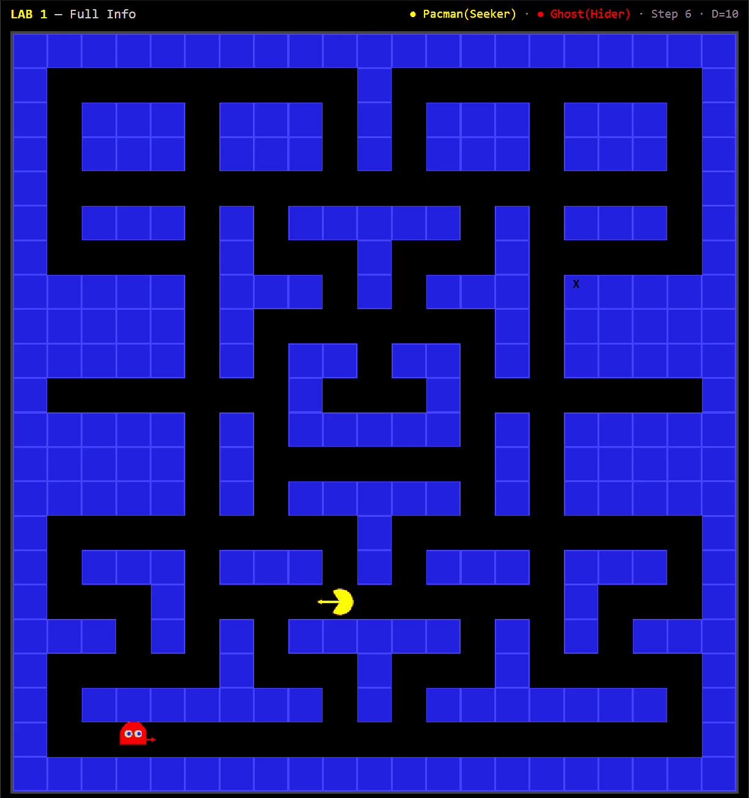

# Hide & Seek Arena — AI Agent Competition Platform

**CSC14003 — Introduction to Artificial Intelligence**

A full-stack platform for adversarial AI agent matches on a static 22×21 grid map, featuring a TypeScript backend orchestrator, React visualization dashboard, and Python agent frameworks for two distinct labs.

<p align="center">
  
  
</p>

---

## Table of Contents

1. [Overview](#overview)
2. [System Architecture](#system-architecture)
3. [Quick Start](#quick-start)
4. [Lab 1 — Adversarial Search](#lab-1--adversarial-search)
5. [Lab 2 — POMDP / Blind Adversary](#lab-2--pomdp--blind-adversary)
6. [Running the TypeScript UI & Backend](#running-the-typescript-ui--backend)
7. [Running Python Labs Directly](#running-python-labs-directly)
8. [API Reference](#api-reference)
9. [Techniques Used](#techniques-used)
10. [Modification Restrictions](#modification-restrictions)
11. [Performance Constraints](#performance-constraints)

---

## Overview

Two AI agents compete on a static Pacman-style grid map:

| Role | Agent Name | Objective | Win Condition |
|------|------------|-----------|---------------|
| **Seeker** | PacmanAgent | Chase and capture the Ghost | Manhattan distance < `captureDistance` (default 2) |
| **Hider** | GhostAgent | Evade and survive all steps | Survive all `maxSteps` (default 200) |

**Important naming convention:** Inside `pacman/` and `blind/` lab workspaces, `PacmanAgent = Seeker`, `GhostAgent = Hider`. The root `agent.py` tournament entry uses the opposite naming — do not let this confuse you when working inside the labs.

**Movement model:**
- **Pacman (Seeker):** returns `Move` or `(Move, steps)` with `1 ≤ steps ≤ pacmanSpeed` (default 2). Straight-line only, stops at walls.
- **Ghost (Hider):** returns `Move` only. Returning a tuple or string is an instant forfeit.
- Turns are **synchronous** — both agents move simultaneously; you cannot react to the opponent's current move.

### Two Labs

| Lab | Name | Observability | Key Challenge |
|-----|------|---------------|---------------|
| **Lab 1** | Adversarial Search | Full (perfect info) | Minimax, Alpha-Beta, A*, heuristic evaluation |
| **Lab 2** | POMDP / Blind Adversary | Partial (fog-of-war) | Belief-state tracking, particle filters, exploration |

---

## Quick Start

### 1. Install Python dependencies

```bash
pip install -r requirements.txt
```

### 2. Install TypeScript backend

```bash
cd ts-backend
npm install
npm run build
cd ..
```

### 3. Install React frontend

```bash
cd visualizer
npm install
cd ..
```

### 4. Start the backend (SSE server)

```bash
cd ts-backend
npm run dev
# Server running at http://localhost:3001
# SSE stream at http://localhost:3001/api/sse
```

### 5. Start the frontend (dashboard)

```bash
cd visualizer
npm run dev
# Dashboard at http://localhost:5173
```

### 6. Full system launch (Linux/macOS)

```bash
./run_game.sh
```

Runs smoke test → generates replay → starts visualizer at http://localhost:5173.

### 7. Generate replay from CLI

```bash
cd ts-backend
npm run generate-replay         # Default replay (40 steps)
npm run generate-balanced       # Balanced replay (60 steps)
```

---

## Lab 1 — Adversarial Search

**Workspace:** `pacman/` | **Observability:** Full (perfect information)

A fully observable environment where both agents always see each other's positions.

### Environment

- Map: static 21×21 grid. `0` = empty, `1` = wall
- Pacman speed: 2 cells/turn (default)
- Capture distance: 2 (Manhattan)
- Max steps: 200
- Turns: synchronous (simultaneous movement)

### Running Lab 1 via TypeScript UI

1. Start the backend (`cd ts-backend && npm run dev`)
2. Start the frontend (`cd visualizer && npm run dev`)
3. Open http://localhost:5173
4. Select **Lab 1** tab in the Control Panel
5. Choose agents (TS or Python engine), adjust parameters
6. Click **Start** to watch the real-time match visualization

### Running Lab 1 via Python CLI

```bash
cd pacman/src

# Visual match (delay 0.3s between steps)
python arena.py --seek team_submission --hide example_student --delay 0.3

# Headless match (no visualization)
python arena.py --seek team_submission --hide example_student --no-viz --max-steps 200

# With random starting positions
python arena.py --seek team_submission --hide example_student --no-viz --start-mode stochastic --max-steps 200

# Custom parameters
python arena.py --seek team_submission --hide example_student --pacman-speed 3 --capture-distance 2
```

### Benchmarking Lab 1

```bash
# 10-game benchmark (deterministic)
python pacman/scripts/benchmark_agents.py --seek team_submission --hide example_student --games 10

# Smoke test
python pacman/scripts/run_smoke_test.py

# Run all tests
python -m pytest pacman/tests -v
```

### Scoring & Tie-Break

| Role | Formula |
|------|---------|
| **Ghost (Hider)** | `winrate_hide = Hide wins / Hide games` |
| **Pacman (Seeker)** | `winrate_seek = Seek wins / Seek games` |

**Tie-break:** `diff = avg_steps_pacman - avg_steps_ghost` (lower is better). Pacman should capture quickly; Ghost should survive as long as possible.

---

## Lab 2 — POMDP / Blind Adversary

**Workspace:** `blind/` | **Observability:** Partial (fog-of-war)

A partially observable environment where the map is shrouded in dynamic fog-of-war. Agents make decisions based on accumulated observations.

### Key differences from Lab 1

| | Lab 1 | Lab 2 |
|---|---|---|
| **Information** | Perfect (entire map) | Partial (fog-of-war) |
| **Vision** | Full 21×21 | Cross-shaped, radius 5, blocked by walls |
| **`map_state`** | `0`=empty, `1`=wall | `0`=seen-empty, `1`=wall, **`-1`=unseen** |
| **`enemy_position`** | Always present | May be **`None`** (opponent out of sight) |
| **Strategy** | Optimal pathfinding | Reasoning under uncertainty |

### Fog-of-War Mechanism

Cross-shaped vision: agent sees up to 5 cells in each cardinal direction. Line-of-sight is **blocked by walls**. Example:

```
? ? ? . ? ? ?
? ? ? . ? ? ?
. . . G . . .     G = Ghost position
? ? ? . ? ? ?     . = visible cell
? ? ? # ? ? ?     # = wall (blocks vision)
? ? ? ? ? ? ?     ? = unseen cell
```

### Running Lab 2 via TypeScript UI

1. Start the backend (`cd ts-backend && npm run dev`)
2. Start the frontend (`cd visualizer && npm run dev`)
3. Open http://localhost:5173
4. Select **Lab 2** tab in the Control Panel
5. Configure observation radii (default 5 for both agents)
6. Click **Start** — fog-of-war visualization is rendered in real-time

### Running Lab 2 via Python CLI

```bash
cd blind/src

# Visual match with fog-of-war (default radii = 5)
python arena.py --seek example_student --hide example_student \
    --pacman-obs-radius 5 --ghost-obs-radius 5 --delay 0.3

# Headless match
python arena.py --seek team_submission --hide example_student \
    --pacman-obs-radius 5 --ghost-obs-radius 5 --no-viz --max-steps 200

# Custom observation radii
python arena.py --seek team_submission --hide example_student \
    --pacman-obs-radius 3 --ghost-obs-radius 7 --no-viz
```

### Benchmarking Lab 2

```bash
# 10-game benchmark (fog-of-war ON by default)
python blind/scripts/benchmark_agents.py --seek team_submission --hide example_student --games 10

# Smoke test
python blind/scripts/run_smoke_test.py

# Run all tests
python -m pytest blind/tests -v
```

---

## Running the TypeScript UI & Backend

The TypeScript backend (`ts-backend/`) is the central orchestrator. It manages match state, runs the simulation loop, and streams events to the frontend via SSE. It supports three engine modes:

| Engine | Description |
|--------|-------------|
| `ts` | Pure TypeScript agents (HideAgent/SeekAgent inside `ts-backend/src/agents/`) |
| `python` | Spawns Python child process via `PythonBridge`, JSON Lines protocol |
| `hybrid` | Mixed — e.g., Pacman in Python, Ghost in TypeScript |

### Backend Commands

```bash
cd ts-backend

# Development mode (hot-reload via tsx watch)
npm run dev

# Production build + start
npm run build
npm run start

# Generate replay JSON (no server needed)
npm run generate-replay
npm run generate-balanced
```

### Frontend Commands

```bash
cd visualizer

# Development mode (hot-reload via Vite)
npm run dev

# Production build
npm run build

# Preview production build
npm run preview
```

### Complete Flow: Simulating a Lab Match with UI

1. **Start backend** (terminal 1):
   ```bash
   cd ts-backend && npm run dev
   ```
   Backend listens on `http://localhost:3001`.

2. **Start frontend** (terminal 2):
   ```bash
   cd visualizer && npm run dev
   ```
   Dashboard opens at `http://localhost:5173`.

3. **In the browser dashboard:**
   - Select **Lab 1** or **Lab 2** tab
   - Choose Pacman agent (ts/python) and Ghost agent (ts/python)
   - Choose engine mode (ts/python/hybrid)
   - Adjust parameters: `maxSteps`, `captureDistance`, `pacmanSpeed`, observation radii (Lab 2)
   - Click **Start** to begin the real-time match
   - Use **Pause** / **Resume** / **Reset** buttons for match control
   - The canvas renders agents, walls, fog-of-war (Lab 2), and various visual layers

4. **Match lifecycle events (SSE):**
   - `connected` — SSE connection established
   - `map_data` — initial map grid sent
   - `match_start` — match begins, initial positions
   - Step events — per-tick data (positions, actions, scores, Manhattan distance)
   - `match_end` — winner declared, final stats
   - `paused` / `resumed` / `reset` — lifecycle control events

---

## Running Python Labs Directly

You can run matches entirely in Python without the TypeScript stack. Each lab has its own `arena.py` runner.

### Lab 1 Quick Run

```bash
# From repo root
python pacman/src/arena.py --seek team_submission --hide example_student

# Or cd into src first (no --submissions-dir flag needed)
cd pacman/src
python arena.py --seek team_submission --hide example_student --delay 0.3
```

### Lab 2 Quick Run

```bash
cd blind/src
python arena.py --seek team_submission --hide example_student \
    --pacman-obs-radius 5 --ghost-obs-radius 5 --delay 0.3
```

### Available CLI Flags (both labs)

| Flag | Default | Description |
|------|---------|-------------|
| `--seek <id>` | required | Seeker agent ID |
| `--hide <id>` | required | Hider agent ID |
| `--max-steps` | 200 | Maximum steps before ghost wins |
| `--capture-distance` | 2 | Manhattan threshold for capture |
| `--pacman-speed` | 2 | Cells per turn for Pacman |
| `--delay` | 0.1 | Seconds between steps (visualization) |
| `--no-viz` | off | Disable terminal visualization |
| `--start-mode` | deterministic | `stochastic` for random spawns |
| `--step-timeout` | 1.0s | Per-step time limit (UNIX only) |

**Lab 2 additional flags:**

| Flag | Default | Description |
|------|---------|-------------|
| `--pacman-obs-radius` | 5 | Pacman observation radius |
| `--ghost-obs-radius` | 5 | Ghost observation radius |

### Running Tests

```bash
# Root tests
python -m pytest tests/ -v

# Lab 1 tests
python -m pytest pacman/tests/ -v

# Lab 2 tests
python -m pytest blind/tests/ -v

# Smoke tests
python pacman/scripts/run_smoke_test.py
python blind/scripts/run_smoke_test.py
```

---

## Techniques Used

### Lab 1: Adversarial Search (Perfect Information)

**PacmanAgent (Seeker — student 24127561):**

| Technique | Description |
|-----------|-------------|
| **A\* Search** | Shortest-path pursuit toward Ghost with Manhattan heuristic, heapq-optimized O(N log N) |
| **Streak Interception** | Tracks Ghost direction over consecutive steps; projects Ghost 4 cells forward to intercept at junctions/corridors |
| **Path Caching** | Caches A\* path per target; reuses when target and position unchanged between steps |
| **Speed-2 Packing** | Packs consecutive same-direction A\* steps up to `pacmanSpeed` for straight-line acceleration |
| **Trap Pressure** | Optional: extends straight-line movement to pressure Ghost escape routes near junctions |
| **Junction Targeting** | Prefers interception at cells with degree ≥ 3 (junctions) to cut off Ghost options |
| **Fallback Exploration** | Random shuffle + unvisited-bonus exploration when Ghost position is unknown |

**GhostAgent (Hider — student 24127192):**

| Technique | Description |
|-----------|-------------|
| **US-L\* (Online Opponent Learning)** | Learns Pacman movement patterns via abstract state-action counts with confidence weighting; adapts over time |
| **Iterative Deepening Maximin Search** | Depth 2–17 maximin tree; Ghost maximizes, Pacman minimizes; expands until time budget (0.95s) |
| **Multi-Model Opponent Prediction** | Ranks Pacman next positions from 7 models: A\* (speed-aware), Greedy Best-First, Exact BFS chaser — each toward Ghost or interception target |
| **Capture ETA (Time-to-Capture)** | `capture_eta(start, target)`: computes how many turns Pacman needs to reach capture range, accounting for `pacmanSpeed` |
| **Safe Area** | `safe_area(ghost, pac_positions)`: flood-fill counts cells where Ghost arrives before any predicted Pacman position |
| **Map Topology Analysis** | Pre-computes dead-ends, junctions, corridors, core region (iterative leaf pruning), and largest DFS-detected cycle |
| **Phase-Based Strategy** | Transition system: Opening Spread → Far Reading → Loop Lure (committed/uncommitted) → Counter Loop → Deep Search |
| **Anti-Velocity Scoring** | Penalizes moves that follow Ghost's momentum (predictable) or backtrack to previous position |
| **Cell Safety Scoring** | Weighted score combining: BFS distance, capture ETA, safe area, degree, dead-end depth, junction distance, loop distance, Pacman influence decay |
| **Panic Mode** | When Manhattan ≤ 1, switches to fast multi-criteria greedy escape |

**Shared infrastructure:**

| Component | Description |
|-----------|-------------|
| **BFS Distance Map** | Cached BFS from any source point; used by both agents |
| **Flood Fill** | `reachable_count()` for mobility estimation (max depth limited) |
| **A\* with Heuristic** | Manhattan heuristic A\* for optimal pathfinding |
| **Valid Move Filtering** | Always validates moves against map boundaries and walls |

### Lab 2: POMDP / Blind Adversary (Partial Observability)

All Lab 2 agents share these foundations:

| Technique | Description |
|-----------|-------------|
| **Persistent Memory Map** | Accumulates observations across steps: visible cells overwritten, unseen cells remain `-1` |
| **Optimistic Traversability** | Treats `-1` (unseen) cells as potentially passable for A\* pathfinding; walls (`1`) always block |
| **Enemy Position Handling** | Falls back to `last_known_enemy_position` when `enemy_position is None` |
| **Frontier-Based Exploration** | When enemy lost, navigates to nearest known-empty cell adjacent to unknown cells |

**PacmanAgent (Blind Seeker — student 24127561):**

| Technique | Description |
|-----------|-------------|
| **A\* on Memory Map** | Pathfinding runs on accumulated memory, treating `-1` as open |
| **Streak Interception (Blind)** | Same direction-tracking as Lab 1, projecting Ghost positions on memory map |
| **Frontier Exploration** | Scans entire memory map for frontier cells (known `0` adjacent to `-1`); picks nearest |
| **Path Caching** | Reuses computed A\* paths when target unchanged |

**GhostAgent (Blind Hider — student 24127192):**

| Technique | Description |
|-----------|-------------|
| **A\*-Strategic Evasion** | When BFS distance > threshold, runs A\* to farthest safe cell (BFS-turns-to-capture filter) |
| **Minimax Alpha-Beta (Depth 8)** | Tactical evasion: Ghost maximizes distance, Pacman modeled with speed-2 reach |
| **Floodfill Safety Scoring** | Counts cells where Ghost arrives before Pacman (considering Pacman speed); applies dead-end/junction weighting |
| **Anti-Oscillation** | Filters moves that lead back to cells in recent history (6-step window) |
| **Topology Analysis** | Pre-computes dead-end cells (degree ≤ 1) for penalty weighting |
| **BFS with LRU Cache** | Cached BFS distance maps for repeated queries |

**RL Agent (student 24127457):**

| Technique | Description |
|-----------|-------------|
| **Recurrent Actor-Critic (A2C + LSTM)** | PyTorch model with LSTM hidden state (128 units) for memory across steps |
| **3-Channel Observation Tensor** | wall (1), seen-empty (0), fog (-1) → 3 binary channels |
| **Position Normalization** | Agent position encoded as `[row/H, col/W]` float vector |
| **Deadlock Guards** | Anti-stuck: forces random move + LSTM reset after 3 consecutive STAYs or 5 steps with no position change |
| **Deterministic Inference** | `get_action_and_value(deterministic=True)` for tournament play |
| **Separate Models** | Two trained models: `pacman_model.pth` and `ghost_model.pth` |
| **Action Space** | Pacman: 9 actions (4 directions × 2 speeds + STAY); Ghost: 5 actions (4 directions + STAY) |

### TypeScript Agent Ports (ts-backend/)

The TypeScript backend includes complete ports of the Python reference agents, used when `engine: "ts"`:

| Agent | File | Key Algorithm |
|-------|------|---------------|
| **HideAgent** | `ts-backend/src/agents/hideAgent.ts` | Minimax + Alpha-Beta (depth 3), `evaluateHide()` heuristic, visit counter, stay penalty |
| **SeekAgent** | `ts-backend/src/agents/seekAgent.ts` | A\* path + `predictedHideMoves()` (top-3 targets) + Minimax (depth 2), `evaluateSeek()` |
| **SearchBoard** | `ts-backend/src/search/bfs.ts` | BFS distance map (cached), degree map, dead-end distance, `setFog()` for fog-of-war |
| **A\*** | `ts-backend/src/search/astar.ts` | `astarPath()`, `firstMoveFromPath()` with Manhattan heuristic |
| **Flood Fill** | `ts-backend/src/search/floodFill.ts` | `reachableArea()`, `safeArea()` |
| **Fog-of-War** | `ts-backend/src/movement.ts` | `computeFogGrid()`, `isVisible()` — ray-casting line-of-sight |

---

## Modification Restrictions

| Area | Status | Rationale |
|------|--------|-----------|
| `src/` (Python core) | FORBIDDEN | Reference agent implementation |
| `pacman/src/` | FORBIDDEN | Lab 1 core framework |
| `blind/src/` | FORBIDDEN | Lab 2 core framework |
| `tests/` | FORBIDDEN | Unit test suite |
| `scripts/` | FORBIDDEN | Tooling scripts |
| `agent.py` (root) | FORBIDDEN | Tournament entry point |
| `ts-backend/` | ALLOWED | Orchestration layer |
| `visualizer/` | ALLOWED | Frontend dashboard |
| `pacman/submissions/<id>/` | ALLOWED | Lab 1 agent code |
| `blind/submissions/<id>/` | ALLOWED | Lab 2 agent code |

---

## Performance Constraints

| Constraint | Limit |
|------------|-------|
| **Time per step** | < 1.0 second (aim for < 0.85s budget) |
| **Memory (RAM)** | < 128 MB |
| **Python** | 3.11 |
| **Lab 1 allowed libs** | `numpy`, `pandas`, `scipy`, `gurobi` |
| **Lab 2 allowed libs** | `numpy`, `pandas`, `scipy`, `gurobi`, `pytorch`, `scikit-learn` |

### Submission Files

- Lab 1 final agent: `pacman/submissions/team_submission/agent.py`
- Lab 2 final agent: `blind/submissions/team_submission/agent.py`
- Must define both `PacmanAgent` and `GhostAgent` classes
- Must inherit from `agent_interface.BasePacmanAgent` / `BaseGhostAgent`
- Must implement `step(map_state, my_position, enemy_position, step_number)` with correct return types

### Export for Submission

```bash
python pacman/scripts/export_submission.py team_submission --force
python blind/scripts/export_submission.py team_submission --force
```

---

*Documentation compiled from actual source code of the Hide & Seek Arena system.*
