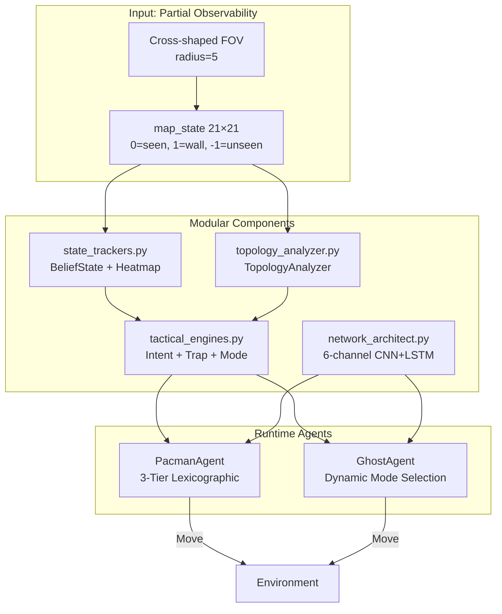
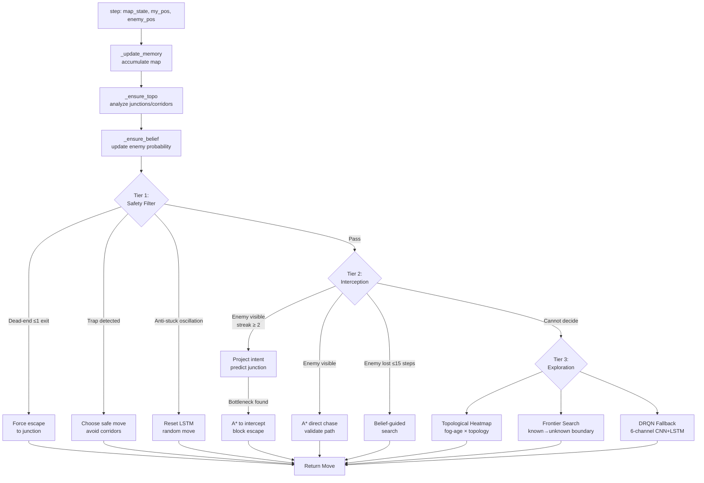
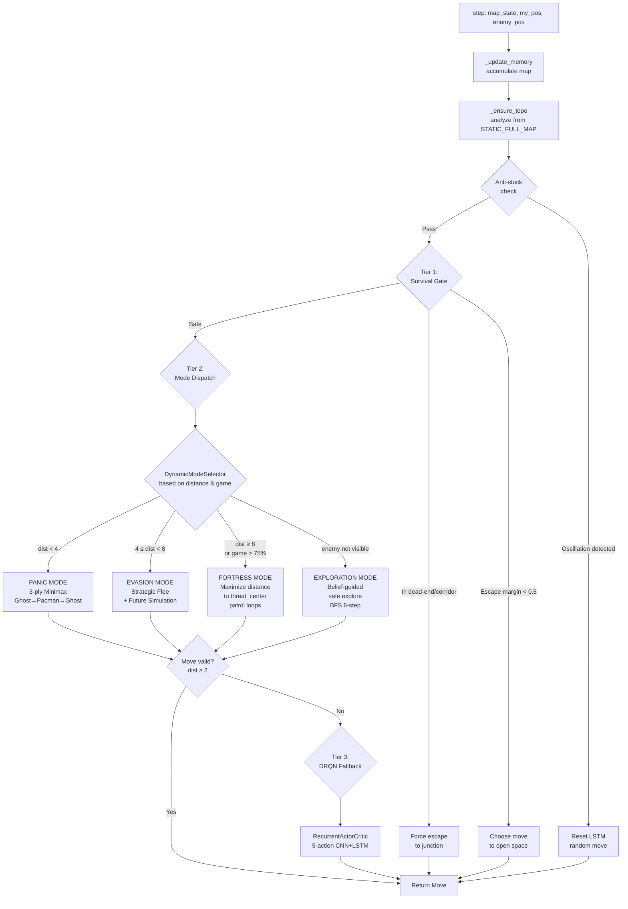
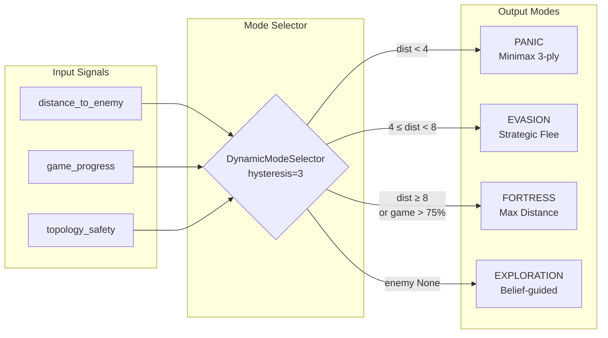
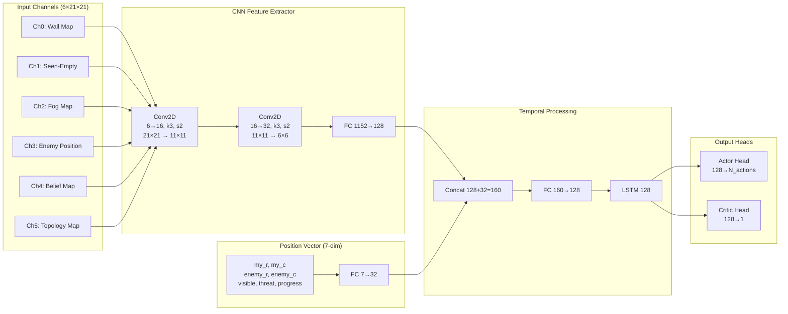
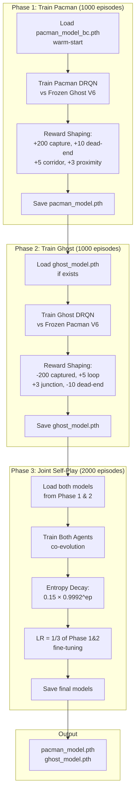

# 24127457 — Blind Adversary (Lab 2)

## Tổng quan

Agent cho bài toán **Blind Adversary** — Lab 2 môn CSC14003 (Nhập môn Trí tuệ Nhân tạo). Trong môi trường này, cả Pacman (Seeker) và Ghost (Hider) đều bị giới hạn tầm nhìn hình chữ thập (cross-shaped FOV, bán kính 5 ô), tạo thành bài toán POMDP (Partially Observable Markov Decision Process).

Kiến trúc V6 kết hợp **Heuristic chiến thuật** (từ các đội Top-tier Bomberland) với **Deep RL** (PPO + RecurrentActorCritic) để đạt hiệu suất cao trong điều kiện thông tin không đầy đủ.

### Tổng quan kiến trúc



---

## Kiến trúc Modular

```
24127457/
├── topology_analyzer.py   # Phân tích hình học bản đồ tĩnh (junction, dead-end, corridor, loop)
├── state_trackers.py      # SpatialHeatmap + BeliefStateTracker (theo dõi fog & xác suất enemy)
├── tactical_engines.py    # IntentTracker + TrapEvaluator + DynamicModeSelector
├── network_architect.py   # RecurrentActorCritic (6-channel CNN + LSTM)
├── agent.py               # Runtime entrypoint: PacmanAgent + GhostAgent
├── train_rl.py            # 3-Phase PPO training pipeline
└── train_pipeline.ipynb   # Notebook huấn luyện trực quan
```

---

## PacmanAgent — 3-Tier Lexicographic Architecture

Lấy cảm hứng từ "Fortress-Farmer" (Top 2 Global Bomberland), Pacman sử dụng pipeline quyết định phân tầng nghiêm ngặt:

### Tier 1: Safety & Trap Filter
- **Dead-end escape**: Nếu Pacman đang ở ô có ≤1 lối thoát → buộc rời ngay
- **Corridor trap avoidance**: Lọc bỏ các nước đi dẫn vào hành lang mà Ghost có thể thoát
- **Anti-stuck**: Phát hiện oscillation (lặp vị trí ≥4 lần) → reset LSTM + random move
- Nếu Tier 1 kích hoạt → **OVERRIDE** toàn bộ tier dưới

### Tier 2: Dynamic Interception & Intent Prediction
- **Phase A — Intent Projection**: Nếu Ghost di chuyển ổn định ≥2 bước cùng hướng → dự đoán junction đích đến (depth 5) → tính bottleneck node để chặn đầu
- **Phase B — Direct Chase**: A* trực tiếp đến Ghost nhưng validate đường đi không qua dead-end corridor
- **Phase C — Belief-Guided Search**: Nếu mất dấu ≤15 bước → dùng BeliefStateTracker dự đoán vị trí Ghost → A* đến cell có xác suất cao nhất

### Tier 3: Strategic Exploration & DRQN Fallback
- **Topological Heatmap**: Tìm ô có fog-age cao nhất × topology weight (junction=4x, core=3x, corridor=0.5x)
- **Frontier Search**: Tìm frontier cell (biết/không biết) gần nhất có trọng số topology cao
- **DRQN Fallback**: Nếu heuristic không quyết định được → gọi RecurrentActorCritic (6-channel CNN + LSTM)

### PacmanAgent Decision Flow



---

## GhostAgent — Dynamic Mode Selection Architecture

Lấy cảm hứng từ "samnu" HCMUS (Multi-Layer Predictive Core), Ghost sử dụng bộ lọc an toàn tương lai + 4 mode di chuyển linh hoạt:

### Tier 1: Provable Survival Gate
- **Dead-end escape**: Nếu Ghost đang ở dead-end/corridor → buộc thoát ra junction
- **Escape margin check**: Mô phỏng reachable space của Ghost vs Pacman sau 6 bước → nếu ratio < 0.5 → báo động đỏ, chỉ chọn nước đi mở rộng không gian
- Nếu Tier 1 kích hoạt → **OVERRIDE** toàn bộ tier dưới

### Tier 2: Dynamic Mode Dispatch
Mode được chọn dựa trên `distance_to_enemy`, `game_progress`, `topology_safety`:

| Mode | Điều kiện | Chiến lược |
|------|-----------|------------|
| **PANIC** | distance < 4 | 3-ply Minimax (Ghost→Pacman→Ghost) với trap detection |
| **EVASION** | 4 ≤ distance < 8 | Strategic Flee + Future Simulation (2-step Pacman lookahead) |
| **FORTRESS** | distance ≥ 8 hoặc game > 75% | Maximize distance to threat_center, ưu tiên loops/junctions |
| **EXPLORATION** | enemy not visible | Belief-guided safe explore, BFS 6-step, topology-weighted scoring |

### Tier 3: DRQN Fallback
- Nếu heuristic không quyết định được → gọi RecurrentActorCritic (5-action)

### GhostAgent Decision Flow



### Mode Selection Logic



---

## 6-Channel CNN Architecture

Mạng neural nhận 6 kênh đầu vào để "nhìn thấy" trực tiếp hình học bản đồ:

```
Channel 0: Wall Map          — 1.0 tại ô tường, 0.0 tại ô trống
Channel 1: Seen-Empty Map    — 1.0 tại ô trống đang thấy, 0.0 tại fog
Channel 2: Fog Map           — 1.0 tại ô chưa khám phá (unseen)
Channel 3: Enemy Position    — 1.0 tại vị trí enemy (nếu thấy), 0.0 nếu mất dấu
Channel 4: Belief Map        — Phân phối xác suất Bayesian về vị trí enemy
Channel 5: Topology Map      — Trọng số hình học (junction=1.0, core=0.7, corridor=0.3, dead-end=0.0)
```

**Position Vector (7-dim)**:
```
[my_r/H, my_c/W, enemy_r/H, enemy_c/W, visible_flag, threat_level, game_progress]
```

Kiến trúc mạng:
```
obs (6×21×21) → Conv2D(6→16, k3, s2) → Conv2D(16→32, k3, s2) → FC(1152→128)
pos (7)       → FC(7→32)
                                         concat → FC(160→128) → LSTM(128) → Actor(128→N_act)
                                                                           → Critic(128→1)
```

### CNN Architecture Diagram



---

## Training Pipeline — 3-Phase Curriculum Learning



### Phase 1: Train Pacman DRQN vs Frozen Ghost Heuristic (1000 episodes)
- **Mục tiêu**: Huấn luyện Pacman DRQN để đuổi bắt Ghost V6 heuristic (đóng băng)
- **Warm-start**: `pacman_model_bc.pth` (Behavioral Cloning từ expert data)
- **Reward shaping**:
  - +200 nếu bắt được Ghost
  - -1.5 penalty mỗi bước
  - +1.0 × (prev_dist - cur_dist) — thưởng khi tiến gần Ghost
  - +10.0 nếu Ghost ở dead-end, +5.0 nếu Ghost ở corridor, +3.0 × (4 - ghost_exits) — thưởng khi dồn ép
  - +5.0 × (4 - dist) nếu dist < 4 — thưởng proximity

### Phase 2: Train Ghost DRQN vs Frozen Pacman Heuristic (1000 episodes)
- **Mục tiêu**: Huấn luyện Ghost DRQN để né tránh Pacman V6 heuristic (đóng băng)
- **Reward shaping**:
  - -200 nếu bị bắt
  - +1.0 - 1.0/dist + (cur_dist - prev_dist) × 0.5 — thưởng khi duy trì/khoảng cách
  - +3.0 nếu ở junction, +5.0 nếu ở loop, +2.0 nếu ở core — thưởng topology an toàn
  - -10.0 nếu ở dead-end, -3.0 nếu ở corridor — phạt topology nguy hiểm
  - +2.0 nếu exits ≥ 3 — thưởng không gian thoát

### Phase 3: Joint Self-Play Co-Evolution (2000 episodes)
- **Mục tiêu**: Cả Pacman và Ghost cùng train đối kháng (self-play)
- **Entropy decay**: `0.15 × 0.9992^ep` (giảm dần để khám phá → khai thác)
- **Learning rate**: Giảm còn 1/3 so với Phase 1 & 2 (fine-tuning)
- **Reward**: Kết hợp reward shaping từ Phase 1 & 2

---

## Cách chạy

### 1. Smoke test (kiểm tra code hoạt động)
```bash
cd blind/src
python arena.py --seek 24127457 --hide 24127457 \
    --pacman-obs-radius 5 --ghost-obs-radius 5 --max-steps 200 --no-viz
```

### 2. Huấn luyện model weights
```bash
cd blind/submissions/24127457
python train_rl.py --device cpu          # CPU
python train_rl.py --device cuda         # GPU
```

Hoặc dùng notebook:
```bash
jupyter notebook train_pipeline.ipynb
```

### 3. Benchmark sau khi train
```bash
cd blind
python scripts/benchmark_full.py --seek 24127457 --hide 24127457 --games 50
```

---

## Ước tính thời gian huấn luyện

| Cấu hình | Phase 1 (1000 ep) | Phase 2 (1000 ep) | Phase 3 (2000 ep) | **Tổng** |
|----------|-------------------|-------------------|-------------------|----------|
| CPU (i7/Ryzen 7) | ~12 phút | ~12 phút | ~25 phút | **~50 phút** |
| RTX 3060/4060 | ~3 phút | ~3 phút | ~6 phút | **~12 phút** |

---

## Ràng buộc kỹ thuật

- **Thời gian/step**: ≤ 1.0 giây (STEP_TIME_LIMIT = 0.90s với time bailout)
- **Bộ nhớ**: ≤ 128 MB (CNN ~800KB + belief/topo/heatmap < 50KB → tổng < 50MB)
- **Thư viện**: numpy, torch (PyTorch)

---

## Tham khảo

- **Fortress-Farmer** (Top 2 Global Bomberland): 3-Tier Lexicographic Architecture
- **samnu HCMUS** (Bomberland): Multi-Layer Predictive Core, Enemy Intent Tracking
- **PPO**: Proximal Policy Optimization (Schulman et al., 2017)
- **GAE**: Generalized Advantage Estimation (Schulman et al., 2016)
